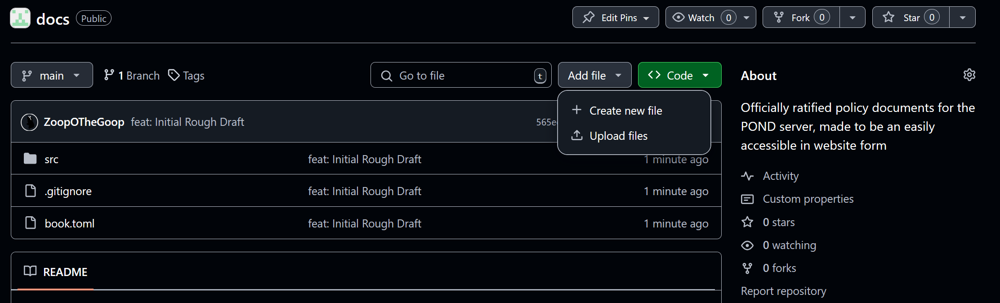
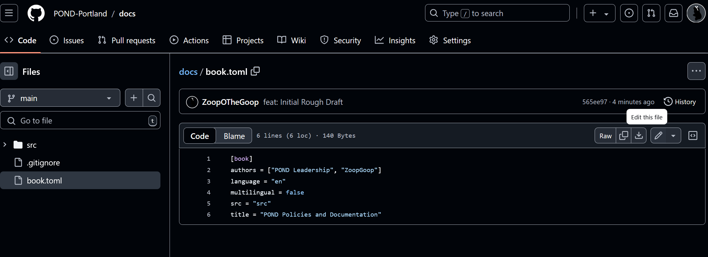
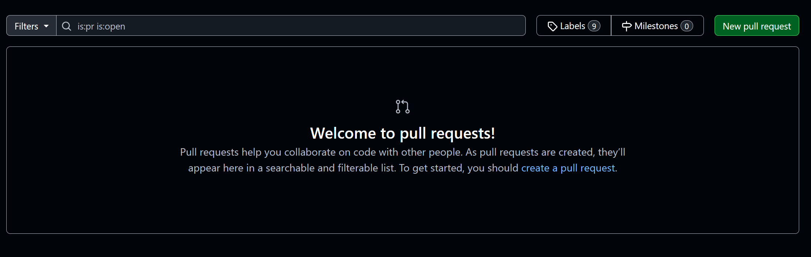

# Documents Editing Guidelines

This is just a set of guidelines and tutorialization for editing these documents.

Firstly, you'll need a [Github](https://github.com) account. Then go to the repository at https://github.com/POND-Portland/docs

After this, you can use the User Interface to add and edit files:

## Edit Process
To add a file, use the interface pictured below:

To add or move a chapter, you need to go into `SUMMARY.md` and add an entry to the table with the name and the path to the file, a technical user can help with this.

To edit a new file, click on it, and then the pen icon:

This will automatically create a "Fork", then open a Pull Request like so:

This should allow us to review and merge the changes.

Note, all revisions should be discussed on the Discord server *first*.

These documents are in Markdown, which is what Discord uses! This is so we can draft them on Discord more easily!

The only thing that doesn't work is these warning tags, peek at the files to figure out how to do these.

If you can't figure it out, ask a more technical leader and they can walk you through it, or submit the final changes for you.

If you are a technical user, check the [mdbook docs](https://rust-lang.github.io/mdBook/index.html) to make your life a little easier.

## Editing Style Guide

This is the style guide for the document:
- All Roles should either link to the role definition, or be in **BOLD**.
- Prefer new pages to sections
- A section with subsections should be under a folder
  - Keep sections organized by naming the file after the chapter name! So if you're adding chapter 4, name it `04-my-chapter.md`
  - For subsections, create a folder with that number `04-my-chapter`, the first file should be the same name as a file, i.e. `01-my-chapter.md`. It's `01-` because it's the first page in that section.
  - When adding to `Summary.md` the `01` should be the same level as its surrounding sections, and `02` and up should be indented.
- We need to write better instructions later.
